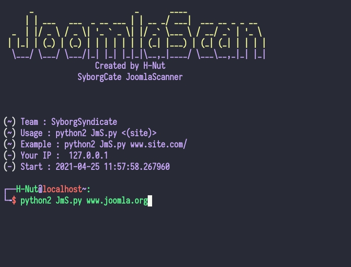
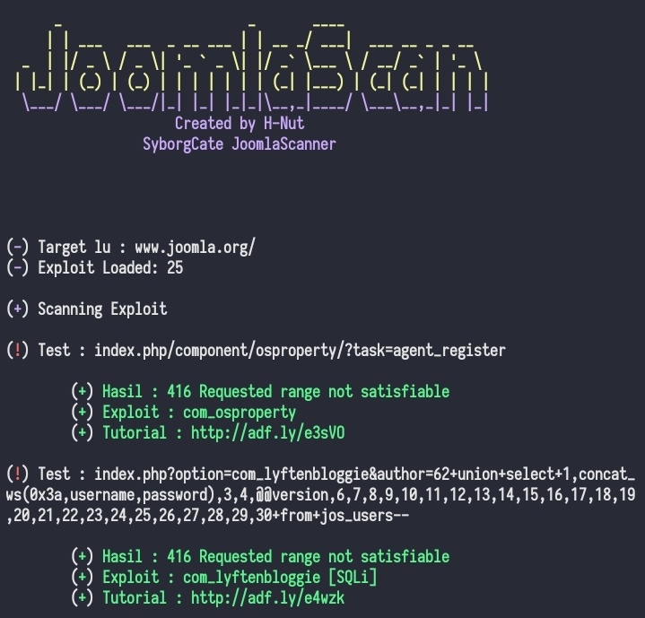

# ExploitJoomla/JoomlaScan
### 🚀Made in python version 2

### Usage⚡
<p align="center">
  <a name="top" href="#octocat-hi-there-thanks-for-visiting-">
     
  </a>
</p>


### Result🔥
<p align="center">
  <a name="top" href="#octocat-hi-there-thanks-for-visiting-">
     
  </a>
</p>

# Installation✨
<details open>
<summary> Android / Linux</summary>

- ```bash
  $ apt update && apt upgrade
  ```

- ```bash
  $ apt install python2 git -y
  ```
- ```bash
  $ apt install pip 
  ```
- ```bash
  $ pip install urllib2

- ```bash
  $ git clone https://github.com/SyborgSyndicate/JoomlaScan
  ```

- ```bash
  $ cd JoomlaScan
  ```

- ```bash
  $ python2 JmS.py
  ```
